# 用 Cocos Creator 制作坦克大战游戏（二）


## *前言*

欢迎大家到[CocosCreator](https://discuss.cocos2d-x.org/)论坛发帖，将你在开发过程中遇到的任何问题发出来与大家一起讨论。在上一篇文章中我们学习了如何使用TiledMap制作地图资源，并在CocosCreator中使用地图资源。在本篇教程，我们开始学习编写一个相对完整的坦克大战游戏。我们已经为大家准备好了新工程：[Tank-War-New](https://github.com/Jno1995/Tank-War-New),你可以在 CocosCreator2.1.2 中打开它并跟着我的教程学习。

如果你在我们的教程中遇到麻烦，请学习一下文档：

- 准备开发环境
  - [Cocos Creator 2.1.2](http://cocos2d-x.org/filedown/CocosCreator_v2.1.2_win)
  - [Tiled Map Editor 0.10.2](https://github.com/Jno1995/TiledMapEditor)
- [文档](https://docs.cocos.com/creator/manual/en/)
  - [TiledMap Component Reference](https://docs.cocos.com/creator/manual/en/components/tiledmap.html?h=tiledmap)

------


## *我们开始吧！*

### 1、编写游戏数据脚本

游戏的各种表现，其过程都是在对游戏数据执行读写操作。通过读取游戏数据，我们可以知道当前的游戏进度、角色状态等等，而写入数据，我们可以操控角色执行任务、保存游戏进度等等。首先在 ./assets/scripts/ 目录下创建 gameData 文件夹，主要用于保存游戏数据脚本。在 gameData 文件夹下创建 GameConfig.js 脚本，主要用于记录游戏配置数据，参考以下代码：

```
var GameConfig = {
    PlayerNum: 1,  //玩家数量
};

module.exports = GameConfig;
```

module.exports 语句是 JS 语言的模块化脚本代码，可以让其它脚本对模块化后的数据脚本中的数据进行读写操作。详细请阅读文档：[Modularize Script](https://docs.cocos.com/creator/manual/en/scripting/modular-script.html)。

在 gameData 文件夹下创建 GameConst.js 脚本，主要用于记录游戏中的各种常量数据，参考以下代码：

```
var GameEnum = require("./GameEnum");
var GameConst = {
	GidToTileType:[
		GameEnum.TileType.tileNone,
		
		GameEnum.TileType.tileNone, GameEnum.TileType.tileNone, GameEnum.TileType.tileGrass, GameEnum.TileType.tileGrass, GameEnum.TileType.tileSteel, GameEnum.TileType.tileSteel, 
		GameEnum.TileType.tileNone, GameEnum.TileType.tileNone, GameEnum.TileType.tileGrass, GameEnum.TileType.tileGrass, GameEnum.TileType.tileSteel, GameEnum.TileType.tileSteel,
	
		GameEnum.TileType.tileWall, GameEnum.TileType.tileWall, GameEnum.TileType.tileRiver, GameEnum.TileType.tileRiver, GameEnum.TileType.tileKing, GameEnum.TileType.tileKing,
		GameEnum.TileType.tileWall, GameEnum.TileType.tileWall, GameEnum.TileType.tileRiver, GameEnum.TileType.tileRiver, GameEnum.TileType.tileKing, GameEnum.TileType.tileKing,
	
		GameEnum.TileType.tileKing, GameEnum.TileType.tileKing, GameEnum.TileType.tileNone, GameEnum.TileType.tileNone, GameEnum.TileType.tileNone, GameEnum.TileType.tileNone,
		GameEnum.TileType.tileKing, GameEnum.TileType.tileKing, GameEnum.TileType.tileNone, GameEnum.TileType.tileNone, GameEnum.TileType.tileNone, GameEnum.TileType.tileNone
	],
	Dirction: ["up","left","down","right"],
	DirctionRex: [/up/,/left/,/down/,/right/],
	EnemyTankTypes: [
		{
			name: "armor",
			score: 500,
			speed: 0.4
		},
		{
			name: "fast",
			score: 250,
			speed: 0.2
		},
		{
			name: "normal",
			score: 100,
			speed: 0.4
		}
	],
	armorTankNum: 4,
	fastTankNum: 3,
	normalTankNum: 2,
	PlayerTankReviveTimes: 5,
	EnemyTankAmount: 20
};
module.exports = GameConst;
```

在 gameData 文件夹下创建 GameEnum.js 脚本，主要用于记录游戏中的各种枚举数据，参考以下代码：

```
var GameEnum = {
    TankFlag: cc.Enum({
        Player: 0,
        Enemy: 1
    }),
    TileType: cc.Enum({
        tileNone: 0, 
        tileGrass: 1, 
        tileSteel: 2, 
        tileWall: 3,
        tileRiver: 4, 
        tileKing: 5
    }),
    TileGroup: cc.Enum({
        default: 0,
        playerBullet: 1,
        playerTank: 2,
        enemyTank: 3,
        enemyBullet: 4
    })
};

module.exports = GameEnum;
```

打开 CocosCreator 游戏引擎的编辑器，打开菜单 Project -> Project Settings...，选择 Group Manager 界面，对游戏的 Group 进行如下设置，并点击 Save 保存设置：

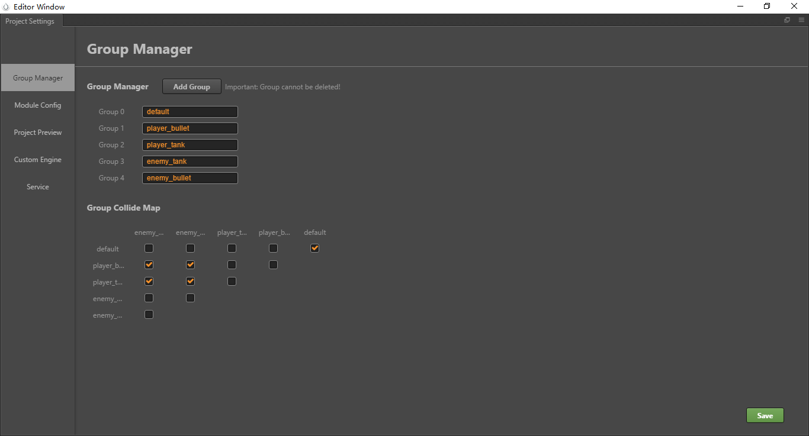

 cc.game.groupList 负责记录着当前游戏的 group 分组数据，我们需要用到它。

---


### 2、布置游戏开始界面

首先预览一下我布置好的游戏开始界面：

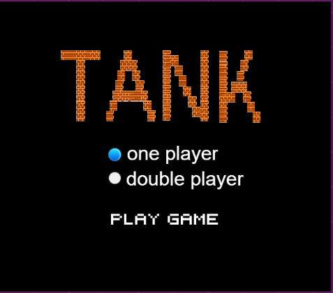

参考下图设置Canvas节点的Canvas组件：

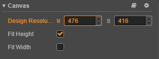

根据设计分辨率，搭建游戏开始场景。参考下图的节点树添加节点：

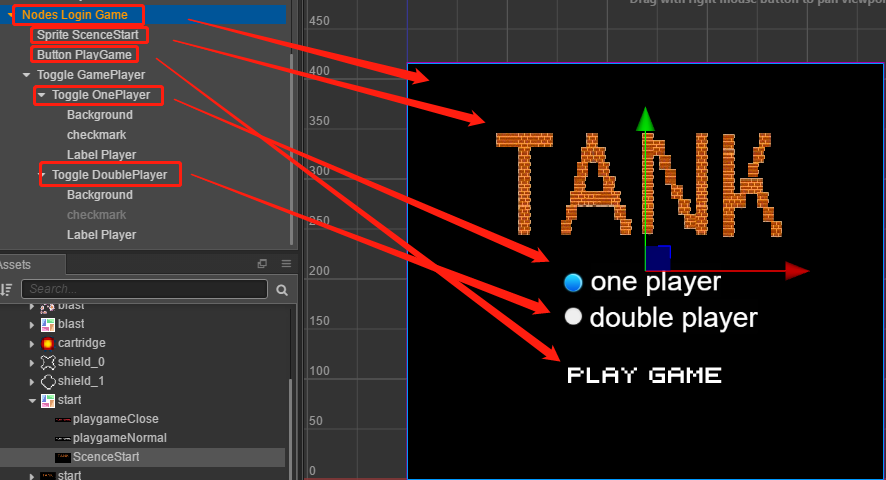

该界面所需要的图集资源名称为 start。

在 ./assets/ 目录下创建 Start.js 脚本，并添加到 Canvas 节点中。该脚本主要负责处理游戏开始界面的用户操作。参考如下代码：

```
var GameConfig = require("./gameData/GameConfig");
cc.Class({
    extends: cc.Component,

    properties: {
        gamePlayerCount: {
            default: null,
            type: cc.ToggleContainer
        },
    },

    start () {
        this.initGameLoginView();
    },
    
	//初始化游戏登录开始界面
    initGameLoginView () {
        switch (GameConfig.PlayerNum) {
            case 1:
                this.gamePlayerCount.node.getChildByName("Toggle OnePlayer").getComponent(cc.Toggle).isChecked = true;
                break;
            case 2:
                console.log(this.gamePlayerCount.node);
                this.gamePlayerCount.node.getChildByName("Toggle DoublePlayer").getComponent(cc.Toggle).isChecked = true;
                break;
        }
    },
	
	//选择玩家人数的回调
    onGamePlayerNumToggleChecked (event, CoustomEventData) {
        switch (CoustomEventData) {
            case "onePlayer":
                GameConfig.PlayerNum = 1;
            break;
            case "doublePlayer":
                GameConfig.PlayerNum = 2;
            break;
        }
    },
});
```

该用户组件的属性检查器界面绑定情况如下：

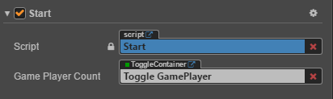

Button PlayGame 节点的 Button 组件的属性检查器界面绑定情况如下，此处绑定的 Game.js 脚本将在第 4 节中讲解：

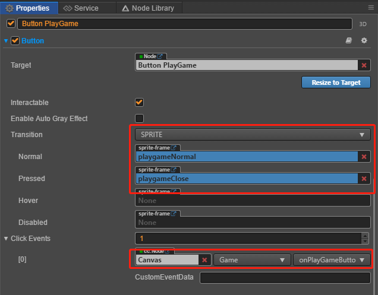

Toggle OnePlayer 节点的 Toggle 组件的属性检查器界面的绑定情况如下：

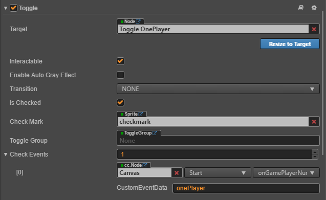

Toggle DoublePlayer 节点的属性检查器界面的绑定情况如下：

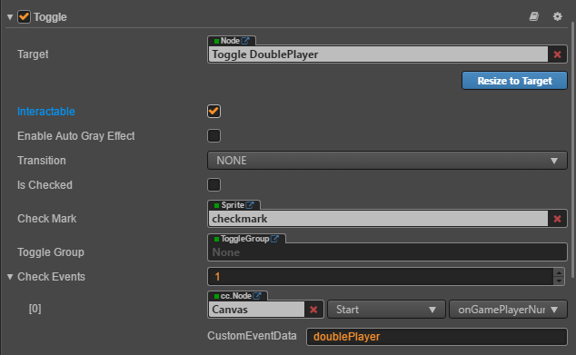

为 Nodes Login Game 节点添加 CCBlockInputEvents 组件，可以防止误触到游戏战斗界面。属性检查器面板如下所示：

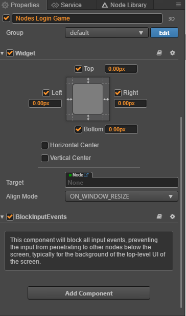

完成上述界面布局与组件数据绑定之后，就完成了游戏开始界面的搭建。

---


### 3、编写对象池管理脚本

坦克大战游戏过程中，会不断有节点销毁和创建的需求，比如子弹的发射与销毁。因为节点的创建和销毁都有一系列的子逻辑需要执行，为了能够彻底清除节点对象的数据，执行这些代码都需要消耗游戏性能。当大量节点都重复创建和销毁时，就会出现游戏性能下降的问题。在 CocosCreator 中，提供了 CCNodePool 对象池模块来优化这个问题，当你使用它，节点的创建和销毁将不会彻底的执行，在将节点移除出场景树的同时，也将失效的节点缓存在节点池中，下次使用的时候再取出来，整个过程的性能消耗比普通方案来得更低，速度更快。在 ./assets/scripts/components 目录下创建 NodePoolManager.js ,可以参考下面代码使用 CCNodePool 来优化你的项目。

```
let NodePoolManager = {
    _nodePools:[],
    _nodePoolNames:["player_bullet","player_tank","enemy_tank","enemy_bullet"],
    
    initNoedPools: function () {
        for (let i = 0; i < this._nodePoolNames.length; i++) {
            this.createNodePool(this._nodePoolNames[i]);
        }
    },

    createNodePool: function (name){
        if (!this.getNodePool(name) && !this.getNodeElement(name)) {
            let nodePool = new cc.NodePool(name);
            this._nodePools.push(nodePool);
            return nodePool;
        }
        else {
            return null;
        }
    },

    getNodePool: function (name) {
        if (this._nodePools.length > 0) {
            for (let i = 0; i < this._nodePools.length; i++) {
                if (this._nodePools[i].poolHandlerComp === name) {
                    return this._nodePools[i];
                }
            }
            return null;
        }
    },

    getNodeElement (name) {
        let nodePool = this.getNodePool(name);
        if (nodePool) {
            let nodeElement = nodePool.get();
            return nodeElement;
        }
        else {
            return null;
        }
    },

    putNodeElemenet (name, element) {
        let nodePool = this.getNodePool(name);
        if (nodePool) {
            nodePool.put(element);
        }
    },
};

module.exports = NodePoolManager;
```

---


### 4、初始化战斗场景

在 Canvas 节点下创建 Nodes Play Game 节点，主要负责渲染坦克大战核心战斗界面。对应的页面布局以及该节点的节点树参考如下：

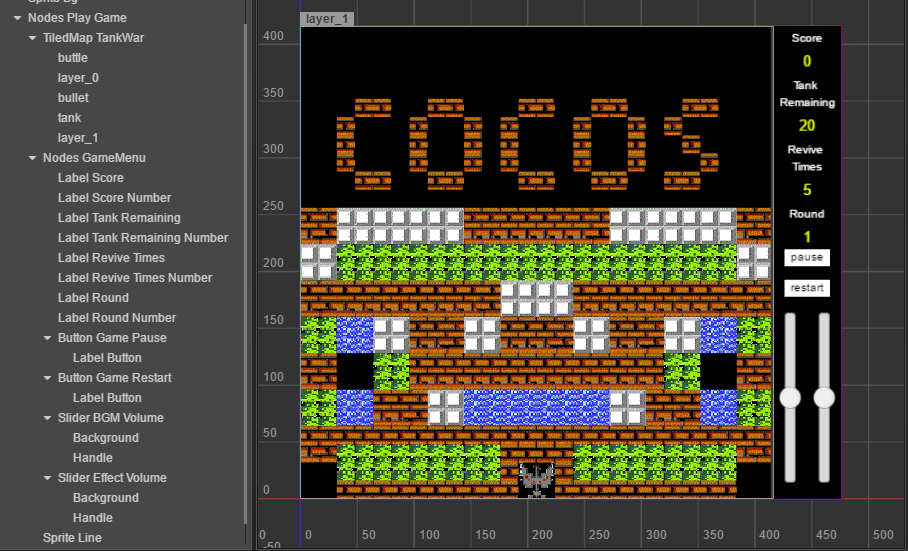

创建完节点并调整界面布局之后，在 ./assets/ 目录下创建 Game.js ,并添加到 Canvas 节点下。该脚本主要用于执行游戏初始化、处理游戏流程、处理玩家输入输出等操作。代码参考如下，我们将项目即将使用到的属性参数也写在脚本上。

```
var GameEnum = require("./gameData/GameEnum");
var GameConst = require("./gameData/GameConst");
var GameConfig = require("./gameData/GameConfig");
var NodePoolManager = require("./components/NodePoolManager");
cc.Class({
    extends: cc.Component,

    properties: {
        loginGame: {
            default: null,
            type: cc.Node
        },
        playGame: {
            default: null,
            type: cc.Node
        },
        tankWarMap:{
            default: null,
            type: cc.TiledMap
        },
        tankSpriteAtlas: {
            default: null,
            type:  cc.SpriteAtlas
        },
        anyTank: {
            default: null,
            type: cc.Prefab
        },
        bullet: {
            default: null,
            type: cc.Prefab
        },
        gameMenu: {
            default: null,
            type: cc.Node
        },
        enemyTankBornPosition: {
            default: [],
            type: cc.Vec2
        },
        playerTankBornPosition: {
            default: [],
            type: cc.Vec2
        },
        _initialRound: 1,
        _enemyTankAmount: 0,
        _playerTankReviveTimes: 0,
        _playing: false,
        _playerTank: [],
        _gameScore: 0,
    },
});
```

组件属性检查器面板的绑定情况如下：


Node AnyTank 的资源路径为 . /assets/res/prefab/Node AnyTank.prefab，布局与 CCSprite 组件的属性检查器面板如下：


Node Buttle 的资源路径为 . /assets/res/prefab/Node Buttle.prefab，布局与 CCSprite 组件的属性检查器面板如下：

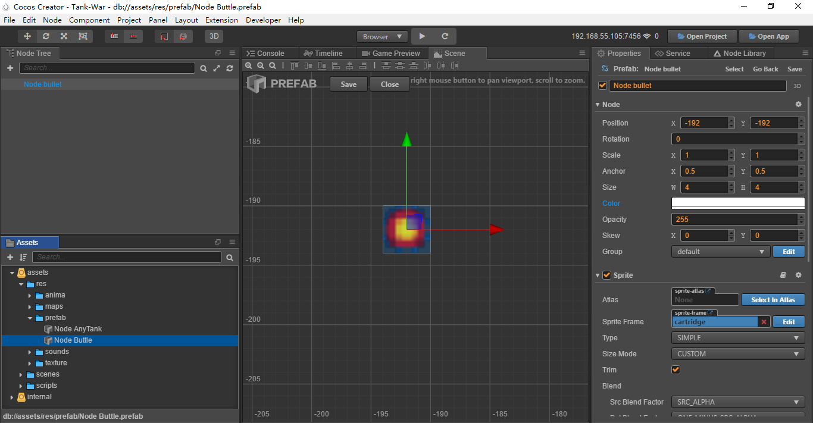

在 Game.js 中添加 onPlayGameButtonClicked 函数，用于开始界面的 Button PlayGame 按钮的点击回调。代码参考如下：

```
    onPlayGameButtonClicked () {
        //隐藏游戏开始界面
        this.loginGame.opacity = false;
        this.loginGame.y += this.node.height;
        //显示游戏战斗界面
        this.playGame.opacity = 255;
        //播放游戏开始音效, SoundManager.js 的编写将在第5部分介绍
        this.node.getComponent("SoundManager").playStartGameEffectSound();
        //执行游戏初始化
        this.initGame();
        //执行游戏开始
        this.startGame();
    },
```

initGame 函数的代码如下：

```
    initGame() {
        //执行对象池初始化
        NodePoolManager.initNoedPools();
    },
```

startGame 函数的代码如下：

```
startGame () {
        //标记游戏开始战斗
        this._playing = true;
        //初始化游戏菜单信息
        this.initGameMenuInfo();
        //清空坦克
        this.clearTanks();
        //根据 EnemyTankAmount 的大小生成相应数量的敌方玩家坦克
        for (let i = 0; i < GameConst.EnemyTankAmount; i++) {
            //每次只生成两个敌方坦克
            if (i < 2) {
                //在指定位置生成敌方坦克
                this.createEnemyTank(this.enemyTankBornPosition[i]);
            }
        }
        //根据 PlayerNum 的大小生成相应数量的玩家坦克
        for (let i = 0; i < GameConfig.PlayerNum; i++) {
            //在指定位置生成玩家坦克
            let playerTank = this.createPlayerTank(this.playerTankBornPosition[i]);
            //将玩家坦克的对象数据保存到 _playerTank 中
            this._playerTank.push(playerTank);
        }
        //初始化游戏监听
        this.initListenHandlers();
    },
```

initGameMenuInfo 的代码如下：

```
initGameMenuInfo() {
        this.gameMenu.getChildByName("Label Tank Remaining Number").getComponent(cc.Label).string = this._enemyTankAmount = GameConst.EnemyTankAmount;
        this.gameMenu.getChildByName("Label Revive Times Number").getComponent(cc.Label).string = this._playerTankReviveTimes = GameConst.PlayerTankReviveTimes;
    },
```

clearTanks 的代码如下：

```
    clearTanks () {
        this._playerTank = [];
        for (let i = 0; i < this.tankWarMap.node.getChildByName("tank").childrenCount; i++) {
            NodePoolManager.putNodeElemenet(this.tankWarMap.node.getChildByName("tank").children[i].group, this.tankWarMap.node.getChildByName("tank").children[i]);
        }
    }
```

createEnemyTank 的代码如下：

```
    createEnemyTank (position) {
        //判断游戏是否处于战斗流程
        if (this.node.getComponent("Game")._playing) {
            //从对象池中获取缓存中的坦克节点对象
            this.enemyTank = NodePoolManager.getNodeElement(cc.game.groupList[3]);
            //当缓存中不存在可用的坦克节点对象时创建一个新的坦克节点对象
            if (!this.enemyTank) {
                this.enemyTank = cc.instantiate(this.anyTank);
            }
            //将节点放置在指定的坐标
            this.enemyTank.setPosition(position);
            //将坦克节点添加到地图中
            this.tankWarMap.node.getChildByName("tank").addChild(this.enemyTank);
        }
    },
```

createPlayerTank 的代码如下：

```
    createPlayerTank (position) {
        //判断游戏是否处于战斗流程
        if (this.node.getComponent("Game")._playing) {
            //从对象池中获取缓存中的坦克节点对象
            this.playerTank = NodePoolManager.getNodeElement(cc.game.groupList[2]);
            //当缓存中不存在可用的坦克节点对象时创建一个新的坦克节点对象
            if (!this.playerTank) {
                this.playerTank = cc.instantiate(this.anyTank);
            }
            //将节点放置在指定的坐标
            this.playerTank.setPosition(position);
            //将坦克节点添加到地图中
            this.tankWarMap.node.getChildByName("tank").addChild(this.playerTank);
            //将创建成功的坦克节点对象抛出
            return this.playerTank;
        }
    },
```

initListenHandlers 的代码如下：

```
    initListenHandlers () {
        cc.systemEvent.on(cc.SystemEvent.EventType.KEY_DOWN, this.onPlayerKeyDownCallback, this);
    },
```

onPlayerKeyDownCallback 的代码暂时不完全补充，将在第5节中完善,暂定代码如下：

```
onPlayerKeyDownCallback () {},
```

在完善玩家对坦克的控制逻辑之前，执行以上的代码之后，游戏运行效果如下：

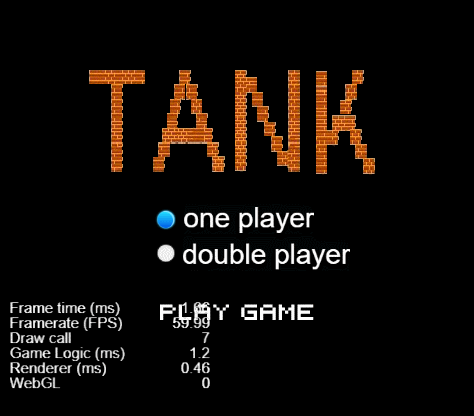

游戏战斗界面正确渲染的同时，坦克们也出现在了指定的位置。

---


### 5、坦克的初始化和管理

在坦克大战游戏中，在同一时刻需要生成不同类型的坦克。所以我们将一个基础类型的坦克节点制作成了 Prefab 资源，然后我们给这个 Prefab 增加能够随时变换类型和样式的能力。首先我们在 ./assets/scripts/components/tank 目录下创建 TankManager.js 脚本，代码参考如下：

```
var GameEnum = require("../../gameData/GameEnum");
var GameConst = require("../../gameData/GameConst");
var NodePoolManager = require("../NodePoolManager");
cc.Class({
    extends: cc.Component,

    editor:{
        // executeInEditMode: true
    },

    properties: {
        isAuto: false,
        isCanMove: true,
        tankSpriteAtlas: {
            default: null,
            type: cc.SpriteAtlas
        },
        tankFlag: {
            default: GameEnum.TankFlag.Player,
            type: GameEnum.TankFlag,
            notify: function () {
                this.updateTank(this.tankFlag);
            }
        },
        enemyTankSpriteFrames: {
            default: [],
            type: cc.SpriteFrame
        },
        playerTankSpriteFrames: {
            default: [],
            type: cc.SpriteFrame
        },
        tankDirection: {
            default: GameConst.Dirction[0],
            notify: function () {
                this.updateTankSpriteFrame(this.tankDirection);
            }
        },
        actionSpeed: {
            default: 0.05,
            type: cc.Float,
            range: [0,3,0.01]
        },
        changeDirectionStep: {
            default: 10,
            type: cc.Integer,
            range: [0,100,1]
        },
        bullet: {
            default: null,
            type: cc.Prefab
        },
        _bornPosition: null,
    },

    // LIFE-CYCLE CALLBACKS:

    // onLoad () {},

    start () {
        if (!CC_EDITOR) {
            //初始化坦克的自动行走
            this.initTankAutoActionManager();
        }
    },

    onEnable () {
        if (this.node.group === cc.game.groupList[2]) {
            //播放坦克的开场动画
            this.node.getComponent(cc.Animation).play();
        }
    },

    //初始化坦克的各种参数
    initTank(tankFlag, direction, group, auto, position) {
        //设置坦克标识（依据GameEnum.TankFlag）
        this.tankFlag = tankFlag;
        //设置坦克风向
        this.tankDirection = direction;
        //设置坦克节点分组
        this.node.group = group;
        //设置是否允许自动行为
        this.isAuto = auto;
        //记录节点出生的初始坐标
        this._bornPosition = position;
        //设置节点坐标
        this.node.setPosition(position);
        //根据节点方向改变节点精灵贴图
        this.updateTankSpriteFrame(direction);
    },

    //更新坦克所绑定的数据
    updateTank (type) {
        //创建新变量用于接收新的精灵贴图对象
        var newSpriteFrame = null;
        //只有类型为 Enemy 的坦克需要更换不同的贴图
        if (type === GameEnum.TankFlag.Enemy) {
            //随机取得新贴图的序号
            var spriteFrameIndex = Math.floor(Math.random() * this.enemyTankSpriteFrames.length);
            //取得随机的贴图
            newSpriteFrame = this.enemyTankSpriteFrames[spriteFrameIndex];
            //从当前坦克类型中获取与贴图名称匹配的坦克配置
            for (let i = 0; i < GameConst.EnemyTankTypes.length; i++) {
                //匹配过程
                if (newSpriteFrame.name.indexOf(GameConst.EnemyTankTypes[i].name) !== -1) {
                    //取得分数数据
                    this._score = GameConst.EnemyTankTypes[i].score;
                    //取得速度数据
                    this.actionSpeed = GameConst.EnemyTankTypes[i].speed;
                }
            }
        }
        else {
            //设置为默认坦克精灵贴图
            newSpriteFrame = this.playerTankSpriteFrames[0];
        }
        //让CCSprite组件将新贴图渲染出来
        this.node.getComponent(cc.Sprite).spriteFrame = newSpriteFrame;
    },

    //更新坦克精灵的贴图
    updateTankSpriteFrame (newDirection) {
        //获取渲染组件
        var tankSprite = this.node.getComponent(cc.Sprite);
        //记录旧贴图的 name 
        var oldSpriteFrameName = tankSprite.spriteFrame.name;
        //新建一个变量用于记录新贴图的 name 
        var newSpriteFrameName = null;
        //遍历贴图名称数组
        for (let i = 0; i < GameConst.DirctionRex.length; i++) {
            //从贴图名称数组中找到与旧贴图相吻合的一项并返回一个新的贴图 name
            newSpriteFrameName = oldSpriteFrameName.replace(GameConst.DirctionRex[i], newDirection);
            //如果新旧贴图的名称不一样，则跳出本次循环
            if (newSpriteFrameName !== oldSpriteFrameName) {
                break;
            }
        }
        //根据新贴图的 name 获取图集中相对应的贴图资源
        if (this.tankSpriteAtlas.getSpriteFrame(newSpriteFrameName)) {
            tankSprite.spriteFrame = this.tankSpriteAtlas.getSpriteFrame(newSpriteFrameName);
        }
    },

    //初始化坦克自动行为
    initTankAutoActionManager() {
        //开启定时器
        this.schedule(this.timerCallBack, this.actionSpeed);
    },

    //定时器回调
    timerCallBack () {
        //判断是否允许自动行为
        if (this.isAuto) {
            //每走n步之后改变方向
            if (!this._changeDirectionStep || this._changeDirectionStep < 0) {
                //改变方向
                this.changeTankDirection();
                //更新当前步数
                this._changeDirectionStep = this.changeDirectionStep;
            }
            else {
                //步数只剩一半时自动发射子弹
                if (this._changeDirectionStep === Math.floor(this.changeDirectionStep / 2)) {
                    //发射子弹
                    this.lauchBullet(cc.game.groupList[4]);
                }
                //如果坦克在地图中遇到障碍物
                if (!cc.find("Canvas").getComponent("TiledMapManager").onTileMovedEvent(this.node)) {
                    //改变坦克方向
                    this.changeTankDirection();
                }
                //步数自动减一
                this._changeDirectionStep--;
            }
            //让坦克在地图中移动
            cc.find("Canvas").getComponent("TiledMapManager").onTileMovedEvent(this.node);
        }
    },
    //改变坦克自身的方向
    changeTankDirection () {
        //获取一个随机序号
        var newDircetionIndex = Math.floor(Math.random() * GameConst.Dirction.length);
        //设置坦克的方向
        this.node.getComponent("TankManager").tankDirection = GameConst.Dirction[newDircetionIndex];
    },

    //发射子弹
    lauchBullet (group) {
        //从对象池中获取子弹对象缓存
        var bullet = NodePoolManager.getNodeElement(group);
        //如果没有子弹对象缓存
        if (!bullet) {
            //实例化一个子弹节点
            bullet = cc.instantiate(this.bullet);
        }
        //设置子弹的方向
        bullet._direction = this.node.getComponent("TankManager").tankDirection;
        //添加子弹到场景中
        cc.find("Canvas").getComponent("Game").tankWarMap.node.getChildByName("bullet").addChild(bullet);
        //执行子弹节点的初始化
        bullet.getComponent("BulletManager").initBullet(this.node, group);
        //播放音效,这部分将在第9节中讲解
        cc.find("Canvas").getComponent("SoundManager").playEffectSound("shoot", false);
    },

    //停止当前组件的计时器
    onUnschedule () {
        this.unschedule(this.timerCallBack);
    },

    onDisable () {
        //关闭当前节点在 ColliderManager 组件中的监听事件
        this.node.targetOff(this.node.getComponent("ColliderManager"));
    }
});
```

将该脚本组件添加到 Node AnyTank 预制体的 Node AnyTank 节点上，它的属性检查器界面的绑定情况如下：

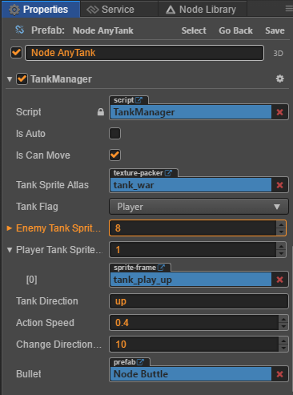

此外，我们可以给玩家坦克的出生添加一个入场动画：

首先在 Node AnyTank 节点下创建一个子节点 Sp Shield ，添加 CCSprite 组件，在 ./assets/res/texture/ 目录下找到 shield_0 贴图，将它添加到 CCSprite 组件的 SpriteFrame 属性框中，此时节点的渲染情况如下：

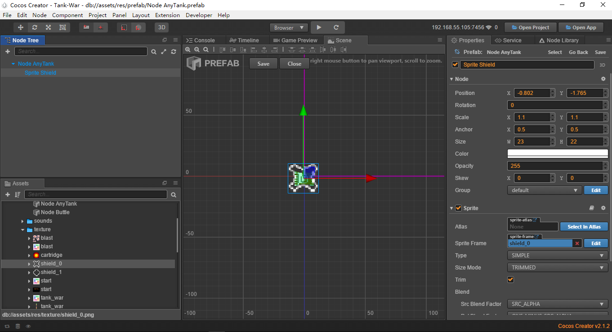

之后，将 Sprite Shield 节点的 active 勾选去掉，回到 Node AnyTank 节点，给它添加 CCAnimation 组件，并且在 ./assets/res/anima/ 目录下创建一个 animationClip 资源，命名为 start，主要用于播放坦克入场动画。CCAnimation 组件的属性检查器面板如下:

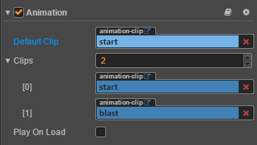

start 序列帧动画在动画编辑器中的设置如下，不懂得怎么使用动画编辑器的可以参考这篇文档：[Animation system](https://docs.cocos.com/creator/manual/en/animation/):

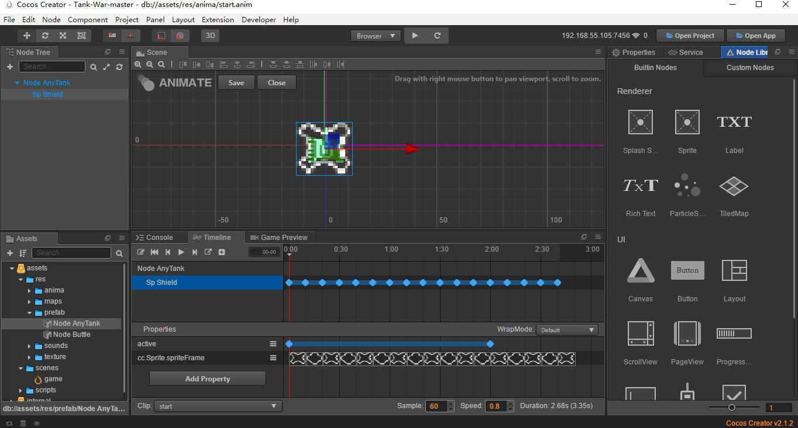

操作完成上述内容之后，游戏的表现如下：

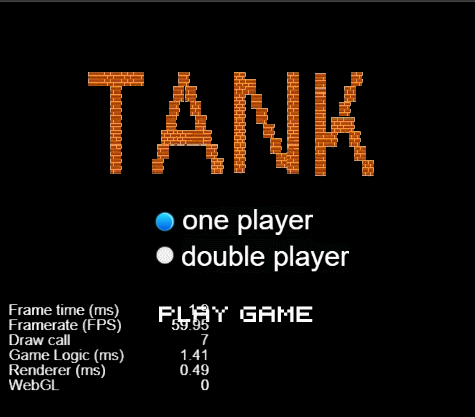

---

### 6、控制坦克在地图中移动

我们需要使用 CocosCreator 引擎的全局系统事件模块来控制玩家的输入输出操作。 全局系统事件是指与节点树不相关的各种全局事件，由 `cc.systemEvent` 来统一派发，目前支持了以下几种事件：键盘事件、设备重力传感事件。在本项目中，玩家1通过按下键盘中的 w、a、s、d 来控制坦克往上、往左、往下、往右移动，并通过按下键盘中的 Space 键来发射子弹。玩家2通过按下键盘中的方向键来控制坦克向四个方向移动，并通过按下 PgUp 键发射子弹。分配完每个键位在游戏中对应的功能之后，我们就可以开始写代码了，参考如下：

```
onPlayerKeyDownCallback (event) {
        switch (event.keyCode) {
            case cc.macro.KEY.w:
                //这是属于玩家1的监听事件
                if (!this._playerTank[0]) return;
                //设置玩家1的坦克的转向
                this._playerTank[0].getComponent("TankManager").tankDirection = GameConst.Dirction[0];
                //将状态改变后的坦克对象传递到坦克地图中
                this.node.getComponent("TiledMapManager").onTileMovedEvent(this._playerTank[0]);
            break;
            case cc.macro.KEY.a: 
                if (!this._playerTank[0]) return;
                this._playerTank[0].getComponent("TankManager").tankDirection = GameConst.Dirction[1];
                this.node.getComponent("TiledMapManager").onTileMovedEvent(this._playerTank[0]);
            break;
            case cc.macro.KEY.s:
                if (!this._playerTank[0]) return;
                this._playerTank[0].getComponent("TankManager").tankDirection = GameConst.Dirction[2];
                this.node.getComponent("TiledMapManager").onTileMovedEvent(this._playerTank[0]);
            break;
            case cc.macro.KEY.d:
                if (!this._playerTank[0]) return;
                this._playerTank[0].getComponent("TankManager").tankDirection = GameConst.Dirction[3];
                this.node.getComponent("TiledMapManager").onTileMovedEvent(this._playerTank[0]);
            break;
            case cc.macro.KEY.up :
                //这是属于玩家2的监听事件
                if (!this._playerTank[1]) return;
                //设置玩家2的坦克的转向
                this._playerTank[1].getComponent("TankManager").tankDirection = GameConst.Dirction[0];
                //将状态改变后的坦克对象传递到坦克地图中
                this.node.getComponent("TiledMapManager").onTileMovedEvent(this._playerTank[1]);
            break;
            case cc.macro.KEY.left: 
                if (!this._playerTank[1]) return;
                this._playerTank[1].getComponent("TankManager").tankDirection = GameConst.Dirction[1];
                this.node.getComponent("TiledMapManager").onTileMovedEvent(this._playerTank[1]);
            break;
            case cc.macro.KEY.down:
                if (!this._playerTank[1]) return;
                this._playerTank[1].getComponent("TankManager").tankDirection = GameConst.Dirction[2];
                this.node.getComponent("TiledMapManager").onTileMovedEvent(this._playerTank[1]);
            break;
            case cc.macro.KEY.right:
                if (!this._playerTank[1]) return;
                this._playerTank[1].getComponent("TankManager").tankDirection = GameConst.Dirction[3];
                this.node.getComponent("TiledMapManager").onTileMovedEvent(this._playerTank[1]);
            break;
            case cc.macro.KEY.space:
                if (!this._playerTank[0]) return;
                //玩家1发射子弹
                this._playerTank[0].getComponent("TankManager").lauchBullet(cc.game.groupList[1]);
                break;
            case cc.macro.KEY.pageup:
                if (!this._playerTank[1]) return;
                //玩家2发射子弹
                this._playerTank[1].getComponent("TankManager").lauchBullet(cc.game.groupList[1]);
                break;
        }
    },
```

为游戏中的子弹编写脚本 BulletManager.js，代码参考如下：

```
var NodePoolManager = require("../NodePoolManager");
cc.Class({
    extends: cc.Component,

    properties: {
        lauchStep: {
            default: 1,
            type: cc.Float,
            range: [0,1,0.01]
        }
    },

    // LIFE-CYCLE CALLBACKS:

    // onLoad () {},

    start () {
        
    },

    //初始化子弹
    initBullet (tank, group) {
        //设置节点分组
        this.node.group = group;
        //设置节点坐标
        this.node.position = tank.position;
        //启动定时器
        this.schedule(this.timerCallBack, this.lauchStep);

    },

    timerCallBack (direction) {
        //设置节点活动边界
        if (this.node.position.x === -208 || this.node.position.x === 204 || this.node.position.y === -204 || this.node.position.y === 208) {
            //将节点从节点树中移除，并将节点对象缓存到对象池中
            NodePoolManager.putNodeElemenet(this.node.group, this.node);
            return;
        }
        else {
            //让子弹在地图中移动
            cc.find("Canvas").getComponent("TiledMapManager").onTileMovedEvent(this.node);
        }
    },

    onDisable () {
        //关闭定时器
        this.unschedule(this.timerCallBack);
    }
    // update (dt) {},
});

```

接下来，就是让坦克在地图中行动。我们需要在 ./assets/scripts/components/ 目录下创建一个地图管理脚本：TiledMapManager.js。该脚本主要负责将节点在节点坐标轴上的行为转化到地图中，请参考下方的代码：

```
var NodePoolManager = require("./NodePoolManager");
var GameEnum = require("./gameData/GameEnum");
var GameConst = require("../gameData/GameConst");
cc.Class({
    extends: cc.Component,

    properties: {
        mainTiledMap: {
            default: null,
            type: cc.TiledMap
        },

        tiledMapAssetSet: {
            default: [],
            type: cc.TiledMapAsset
        },

        tiledMapAssets: {
            default: [],
            type: cc.TiledMapAsset
        },
        _interimPos:[],

    },

    start () {
        //初始化地图数据
        this.initTiledMapData();
    },

    initTiledMapData () {
        //获取 layer_0、layer_1 地图层
        this.mainLayer = this.mainTiledMap.getLayer("layer_0");
        this.secondaryLayer = this.mainTiledMap.getLayer("layer_1");
    },

    //用于将节点在节点坐标中的移动转化为地图坐标移动
    onTileMovedEvent (tileNode, callback) {
        //如果坦克不允许移动，则不执行内部逻辑
        if (tileNode.getComponent("TankManager") && !tileNode.getComponent("TankManager").isCanMove) {
            return;
        }
        //创建一个变量用于缓存节点在节点坐标轴下的初始坐标
        var startPos = cc.v2(tileNode.position.x, tileNode.position.y);
        //创建一个变量用于缓存坦克方向
        var tankDirection = null;
        //如果节点不是坦克
        if (!tileNode.getComponent("TankManager")) {
            //设置方向
            tankDirection = tileNode._direction;
        }
        //如果节点是坦克
        else {
            //设置方向
            tankDirection = tileNode.getComponent("TankManager").tankDirection;
        }
        //根据得到的方向重新设置节点的坐标
        if (tankDirection === GameConst.Dirction[0]) {
            startPos.y += tileNode.height;
        }
        else if(tankDirection === GameConst.Dirction[2]){
            startPos.y -= tileNode.height;
        }
        else if (tankDirection === GameConst.Dirction[1]) {
            startPos.x -= tileNode.width;
        }
        else if (tankDirection === GameConst.Dirction[3]) {
            startPos.x += tileNode.width;
        }
        //将节点坐标转化为地图坐标
        var tilePos = this.getTilePositionAt(tileNode, startPos);
        //设置地图边界
        if (tilePos.y <= this.mainLayer.getLayerSize().height - 1 && tilePos.x <= this.mainLayer.getLayerSize().width - 1
         && tilePos.y >= 0 && tilePos.x >= 0) {
            //获取当前地图坐标所对应的图块ID
            var tileGID = this.mainLayer.getTileGIDAt(tilePos);
            //根据GameConst.GidToTileType取得当前图块对应的类型，再与GameEnum.TileType比较，不同类型的图块对应的变化不同
            //这里处理tileWall类型图块
            if (GameConst.GidToTileType[tileGID] === GameEnum.TileType.tileWall) {
                //根据节点的分组执行不同的逻辑，此处节点分组是tankBullet
                if (tileNode.group === cc.game.groupList[1] || tileNode.group === cc.game.groupList[4]) {
                    //重新设置图块
                    this.mainLayer.setTileGIDAt(0, tilePos.x, tilePos.y);
                    //将坦克从节点树中移除，并将节点对象放到对象池中
                    NodePoolManager.putNodeElemenet(tileNode.group, tileNode);
                }
                //tank
                else if (tileNode.group === cc.game.groupList[2] || tileNode.group === cc.game.groupList[3]) {
                    return false;
                }
            }
            //这里处理tileSteel类型图块
            else if (GameConst.GidToTileType[tileGID] === GameEnum.TileType.tileSteel) {
                if (tileNode.group === cc.game.groupList[1] || tileNode.group === cc.game.groupList[4]) {
                    //播放steel音效，这部分在第9节中讲解
                    cc.find("Canvas").getComponent("SoundManager").playEffectSound("steel", false);
                    NodePoolManager.putNodeElemenet(tileNode.group, tileNode);
                }
                //tank
                else if (tileNode.group === cc.game.groupList[2] || tileNode.group === cc.game.groupList[3]) {
                    return false;
                }
            }
	    //这里处理tileRiver类型图块
            else if (GameConst.GidToTileType[tileGID] === GameEnum.TileType.tileRiver) {
                if (tileNode.group === cc.game.groupList[2] || tileNode.group === cc.game.groupList[3]) {
                    return false;
                }
            }
	    //这里处理tileKing类型图块
            else if (GameConst.GidToTileType[tileGID] === GameEnum.TileType.tileKing) {
                if (tileNode.group === cc.game.groupList[1] || tileNode.group === cc.game.groupList[4]) {
                    //执行游戏结束逻辑
                    cc.find("Canvas").getComponent("Game").onGameOverEvent();
                    NodePoolManager.putNodeElemenet(tileNode.group, tileNode);
                }
                //tank
                else if (tileNode.group === cc.game.groupList[2] || tileNode.group === cc.game.groupList[3]) {
                    return false;
                }
            }
            //将转化过后的节点坐标设置给节点
            tileNode.position = startPos;
            if (typeof callback === "function") {
                //执行回调函数
                callback();
            }
            //抛出节点对象
            return tileNode;
        }
        else {
            return false;
        }
    },

    getTilePositionAt (tileNode, position) {
        //将节点的节点坐标转化为世界坐标
        var worldPosition = tileNode.parent.convertToWorldSpaceAR(position);
        //获取地图节点的宽高数据
        var mapSize = this.node.getContentSize();
        //或者地图的宽高数据
        var tileSize = this.mainTiledMap.getTileSize();
        //计算节点在地图中的坐标，并向下取整
        var x = Math.floor(worldPosition.x / tileSize.width);
        var y = Math.floor((mapSize.height - worldPosition.y) / tileSize.height);
        return cc.v2(x, y);
    },

    // update (dt) {},
});
```

将该组件添加到 Canvas 节点上，下面是该组件的属性检查器面板, TiledMapAsset 资源在 ./assets/res/map 目录下：

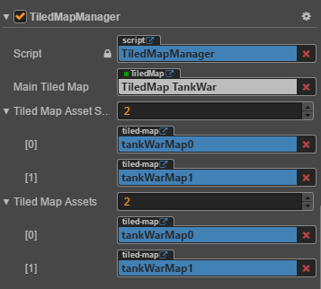

完成这部分操作之后，游戏的表现如下所示：


---


### 7、添加子弹和坦克的碰撞逻辑

我们借助 CocosCreator 引擎的 [Collision System](https://docs.cocos.com/creator/manual/en/physics/collision/) 来处理子弹与坦克之间的碰撞关系。因为我们在第一节已经设置好了 group 分组，所以我们可以直接编写分组管理的脚本 ColliderManager.js，代码参考如下：

```
var GameEnum = require("../gameData/GameEnum");
var NodePoolManager = require("../components/NodePoolManager");
cc.Class({
    extends: cc.Component,

    properties: {
    },

    onLoad () {
        //获取游戏全局的碰撞系统管理对象
        var colliderManager = cc.director.getCollisionManager();
        //开启碰撞管理
        colliderManager.enabled = true;
        //绘制碰撞盒的边框
        // colliderManager.enabledDebugDraw = true;
    },

    //触发碰撞时的回调
    onCollisionEnter (other, self) {
        //将节点从节点树中移除，并将节点对象缓存到对象池中
        NodePoolManager.putNodeElemenet(this.node.group, this.node);
        //分组不同处理不同的逻辑
        if (this.node.group === cc.game.groupList[2]) {
            //玩家坦克的重生次数减一
            --cc.find("Canvas").getComponent("Game")._playerTankReviveTimes;
            //更新战斗界面右侧的游戏信息
            cc.find("Canvas").getComponent("Game").updateGameMenuInfo(this.node, GameEnum.TankFlag.Player);
            //播放 playerTankBoom 音效，音效系统在第9节中讲解
            cc.find("Canvas").getComponent("SoundManager").playEffectSound("playerTankBoom", false);
        }
        else if (this.node.group === cc.game.groupList[3]) {
            //敌方坦克数量减一
            --cc.find("Canvas").getComponent("Game")._enemyTankAmount;
            //更新战斗界面右侧的游戏信息
            cc.find("Canvas").getComponent("Game").updateGameMenuInfo(this.node, GameEnum.TankFlag.Enemy);
            //计算玩家在游戏中获得的分数
            cc.find("Canvas").getComponent("Game").updateScore(this.node.getComponent("TankManager")._score);
            //播放 enemyTankBoom 音效
            cc.find("Canvas").getComponent("SoundManager").playEffectSound("enemyTankBoom", false);
        }
    },

    //碰撞结束时执行的回调
    onCollisionExit (other, self) {
        if (this.node.group === cc.game.groupList[0]) {
            
        }
        else if (this.node.group === cc.game.groupList[0]) {

        }
    },

    initGroup () {}
    // update (dt) {},
});
```

我们只需要将这个组件，添加到 Node AnyTank 预制体的 Node AnyTank 节点、Node Buttle 预制体的 Node Buttle 节点。并且给带有 ColliderManager.js 脚本组件的节点添加 CCBoxCollider 组件。属性检查器界面如下：

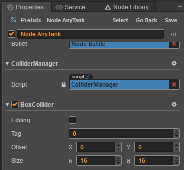

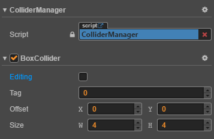

完成上述操作后，子弹和坦克之间就能发生碰撞了，我们看下效果：


---


### 8、游戏结算处理

在坦克发生碰撞之后，更新游戏战斗界面右侧数据时会进行游戏结算。我们在 Game.js 中添加了以下函数：updateGameMenuInfo 函数，代码参考如下：

```
updateGameMenuInfo (targetNode, tankTag) {
        //更新战斗界面右侧游戏信息
        if (cc.find("Canvas").getComponent("Game")._enemyTankAmount > 0 && cc.find("Canvas").getComponent("Game")._playerTankReviveTimes > 0) {
            //创建新的坦克
            this.createNewTank(targetNode, tankTag);
        }
        else if (cc.find("Canvas").getComponent("Game")._enemyTankAmount > 0 && cc.find("Canvas").getComponent("Game")._playerTankReviveTimes === 0){
            //执行游戏失败逻辑
            this.onGameOverEvent("lose");
        }
        else if (cc.find("Canvas").getComponent("Game")._enemyTankAmount === 0 && cc.find("Canvas").getComponent("Game")._playerTankReviveTimes > 0) {
            //进入下一关卡
            this.onNextRoundEvent();
        }
        else if (cc.find("Canvas").getComponent("Game")._enemyTankAmount === 0 && cc.find("Canvas").getComponent("Game")._playerTankReviveTimes === 0){
            //进入下一关卡
            this.onNextRoundEvent();
        }
    },
```

createNewTank 函数的代码如下：

```
    createNewTank (targetNode, tankTag) {
        //根据类型创建不同的坦克
        if (tankTag === GameEnum.TankFlag.Enemy) {
            cc.find("Canvas").getComponent("Game").gameMenu.getChildByName("Label Tank Remaining Number").getComponent(cc.Label).string = cc.find("Canvas").getComponent("Game")._enemyTankAmount;
            cc.find("Canvas").getComponent("Game").createEnemyTank(targetNode.getComponent("TankManager")._bornPosition);
        }
        else if (tankTag === GameEnum.TankFlag.Player) {
            cc.find("Canvas").getComponent("Game").gameMenu.getChildByName("Label Revive Times Number").getComponent(cc.Label).string = cc.find("Canvas").getComponent("Game")._playerTankReviveTimes;
            cc.find("Canvas").getComponent("Game").createPlayerTank(targetNode.getComponent("TankManager")._bornPosition);
        }
    },
```

onGameOverEvent 函数代码如下：

```
    //游戏结束处理
    onGameOverEvent (command) {
        //更新游戏状态
        this._playing = false;
        //根据指令执行不同的逻辑
        if (command === "win") {
            //播放 begin 音效
            this.node.getComponent("SoundManager").playEffectSound("begin", false);
            console.log("[Game Win]");
        }
        else if (command === "lose") {
            //播放 gameOver 音效
            cc.find("Canvas").getComponent("SoundManager").playEffectSound("gameOver", false);
            console.log("[Game Lose]");
        }
        //重启游戏
        this.restartGame();
    },
```

onNextRoundEvent 函数代码如下：

```
    //进入下一关卡
    onNextRoundEvent () {
        //更新关卡值
        ++this._initialRound;
        //关卡值不能大于游戏内置的地图数量
        if (this._initialRound <= this.node.getComponent("TiledMapManager").tiledMapAssets.length) {
            //替换地图资源
            this.tankWarMap.tmxAsset = this.node.getComponent("TiledMapManager").tiledMapAssets[this._initialRound - 1];
            //更新关卡值文本信息
            this.gameMenu.getChildByName("Label Round Number").getComponent(cc.Label).string = this._initialRound;
            //初始化地图数据
            this.node.getComponent("TiledMapManager").initTiledMapData();
            //播放游戏开始音效
            this.node.getComponent("SoundManager").playStartGameEffectSound();
            //执行游戏开始逻辑
            this.startGame();
        }
        else {
            this.onGameOverEvent("win");
        }
    },
```

restartGame 函数代码如下：

```
//重启游戏
    restartGame () {
        //更新游戏状态
        this._playing = false;
        //注销监听事件
        this.unListenHandlers();
        //清空玩家坦克数组缓存
        this._playerTank = [];
        //关闭游戏所有音效
        this.node.getComponent("SoundManager").stopAll();
        //载入 game 场景
        cc.director.loadScene("game");
    },
```


添加以上函数之后，游戏就能在游戏失败的时候回到游戏开始界面，并在游戏当前关卡胜利的时候进入下一关卡。

---


9、添加游戏背景音乐和音效管理

我们通过 SoundManager.js 脚本组件来控制游戏的各种音频播放操作。

```
cc.Class({
    extends: cc.Component,
    editor: {
        menu:"CustomComponent/AudioControl",
    },
    properties: {
        backGroupSound: {
            default: null,
            type: cc.AudioClip
        },

        loop: true,
        
        soundsVolume: {
            default: 1,
            range: [0,1,0.01],
            notify: function() {
                this.setSoundsVolume();
            }
        },

        effectsVolume: {
            default: 1,
            range: [0,1,0.01],
            notify: function () {
                this.setEffectsVolume();
            }
        },

        audioClipPool: {
            default: [],
            type: cc.AudioClip
        },
        
        _isPlaying: false,
        _audioId: null,
        _effectId: null,
    },

    //播放背景音乐
    playBackGroupSound (callback) {
        if (this.backGroupSound) {
            //暂停正在播放的音乐
            cc.audioEngine.stopAll();
            //播放音乐
            this._audioId = cc.audioEngine.play(this.backGroupSound, this.loop, this.soundsVolume);
            //播放完成时执行回调
            if (callback && typeof callback === "function") {
                cc.audioEngine.setFinishCallback(this._audioId, callback);
            }
        }
    },

    //根据不同的指令播放不同的音效
    playEffectSound (command, loop = this.loop, callback) {
        if (command !== null && command !== undefined || this.audioClipPool.length > 0) {
            switch (command) {
                case "begin":
                    this._effectId = cc.audioEngine.playEffect(this.audioClipPool[0], loop);
                    break;
                case "nmoving":
                    this._effectId = cc.audioEngine.playEffect(this.audioClipPool[1], loop);
                    break;
                case "moving":
                    this._effectId = cc.audioEngine.playEffect(this.audioClipPool[2], loop);
                    break;
                case "shoot":
                    this._effectId = cc.audioEngine.playEffect(this.audioClipPool[3], loop);
                    break;
                case "steel":
                    this._effectId = cc.audioEngine.playEffect(this.audioClipPool[4], loop);
                    break;
                case "enemyTankBoom":
                    this._effectId = cc.audioEngine.playEffect(this.audioClipPool[5], loop);
                    break;
                case "playerTankBoom":
                    this._effectId = cc.audioEngine.playEffect(this.audioClipPool[6], loop);
                    break;
                case "gameOver":
                    this._effectId = cc.audioEngine.playEffect(this.audioClipPool[7], loop);
                    break;
                case "pause":
                case "resume":
                    this._effectId = cc.audioEngine.playEffect(this.audioClipPool[8], loop);
                    break;
                case "bouns":
                    this._effectId = cc.audioEngine.playEffect(this.audioClipPool[9], loop);
                    break;
                default:
                    console.error("Command is invalid");
            }
        }
        if (typeof callback === "function") {
            //播放完成时执行回调
            cc.audioEngine.setFinishCallback(this._effectId, callback);
        }
    },

    //暂停音乐
    pauseMusic () {
        cc.audioEngine.pauseAll();
    },

    //恢复音乐
    resumeMusic () {
        cc.audioEngine.resumeAll();
    },

    //设置背景音乐音量
    setSoundsVolume() {
        if (this._audioId) {
            cc.audioEngine.setVolume(this.soundsVolume);
        }
    },

    //设置音效音量
    setEffectsVolume () {
        if (this._effectId) {
            cc.audioEngine.setEffectsVolume(this.effectsVolume);
        }
    },

    //停止所有音乐
    stopAll () {
        cc.audioEngine.stopAll();
        this._audioId = null;
        this._effectId = null;
    },

    //播放开始游戏音乐
    playStartGameEffectSound () {
        this.playEffectSound("begin", false, ()=>{
            this.playEffectSound("nmoving", true);
        });
    },
});
```

将它添加到 Canvas 节点中，属性检查器面板如下：

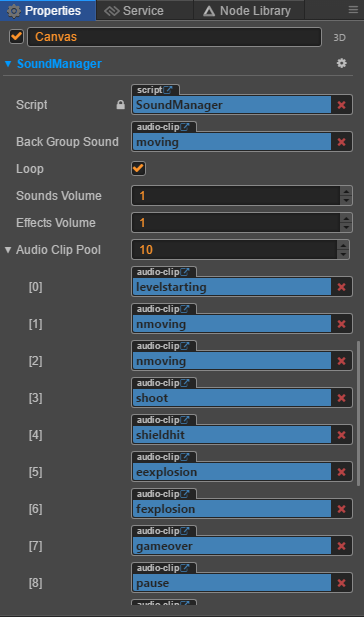

为 Slider BGM Volume 、Slider Effect Volume 这两个 CCSlider 组件添加滑动回调，让它们每次滑动都能调节音量。在 Game.js 脚本中添加 onSliderSwitchEvent 函数，代码如下：

```
    //音量控制滑块
    onSliderSwitchEvent (slider, CustomEventData) {
        //新建一个变量缓存滑块对应的数值
        let volume = slider.progress;
        //根据滑块的自定义参数执行不同的逻辑
        if (CustomEventData === "bgm") {
            //设置背景音乐音量
            this.node.getComponent("SoundManager").soundsVolume = volume;
        }
        else if (CustomEventData === "effect") {
            //设置音效音量
            this.node.getComponent("SoundManager").effectsVolume = volume;
        }
    },
```

将该脚本绑定为 Slider BGM Volume 、Slider Effect Volume 这两个组件的滑动回调，属性检查器界面的绑定情况如下：

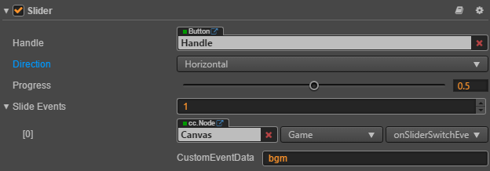

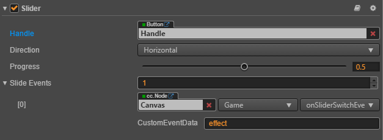

这样就完成了游戏的音频控制操作。

---


### 10、添加游戏暂停、恢复功能以及重玩功能

在 Game.js 脚本中添加 onPauseOrResumeGameEvent 函数来控制游戏的进程，代码如下：

```
//暂停或恢复游戏
    onPauseOrResumeGameEvent () {
        //改变游戏战斗进行中的标签
        this._playing = !this._playing;
        //非战斗进行时
        if (!this._playing) {
            //播放暂停音效
            cc.find("Canvas").getComponent("SoundManager").playEffectSound("pause", false);
            //暂停所有坦克
            for (let i = 0; i< this.tankWarMap.node.getChildByName("tank").childrenCount; i++) {
                //禁止坦克移动
                this.tankWarMap.node.getChildByName("tank").children[i].getComponent("TankManager").isCanMove = false;
                //暂停定时器
                cc.director.getScheduler().pauseTarget(this.tankWarMap.node.getChildByName("tank").children[i].getComponent("TankManager"));
            }
            //改变按钮文本
            this.gameMenu.getChildByName("Button Game Pause").getChildByName("Label Button").getComponent(cc.Label).string = "resume";
            console.log("[Game Pause]");
        }
        else {
            //播放恢复音效
            cc.find("Canvas").getComponent("SoundManager").playEffectSound("resume", false);
            //恢复所有坦克
            for (let i = 0; i< this.tankWarMap.node.getChildByName("tank").childrenCount; i++) {
                //允许坦克移动
                this.tankWarMap.node.getChildByName("tank").children[i].getComponent("TankManager").isCanMove = true;
                //恢复定时器
                cc.director.getScheduler().resumeTarget(this.tankWarMap.node.getChildByName("tank").children[i].getComponent("TankManager"));
            }
            //改变按钮文本
            this.gameMenu.getChildByName("Button Game Pause").getChildByName("Label Button").getComponent(cc.Label).string = "pause";
            console.log("[Game Resume]");
        }
        
    },
```

将 onPauseOrResumeGameEvent 设置为 Button Game Pause 按钮的点击回调，属性检查器界面绑定情况如下：

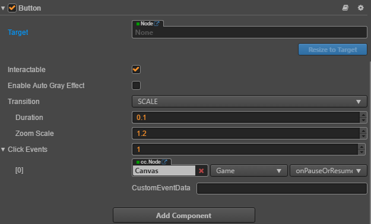

新建一个 CCButton 组件节点命名为 Button Game Restart，为它绑定 Game.js 中的 restartGame 函数为点击结束的回调，属性检查器界面如下：

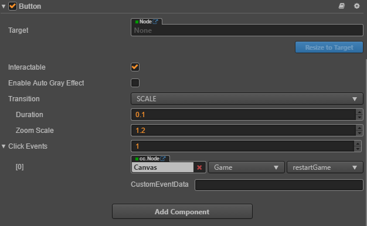

这样就完成了游戏的一些进程控制。

---


### 11、结语

TankWar 的游戏开发教程在本篇完成了，看一下游戏表现（此处为了方便测试将敌方坦克的数量调整为5个）：


目前游戏依然存在很多的优化空间。等你完全掌握教程中所使用的工具	以及编程语言时，你就可以再进一步的在原来的基础上创造出更多有意思的内容。感谢大家对 CocosCreator 游戏引擎的热爱，本篇教程由 Cocos技术顾问团队提供。再次感谢。

---

[complete project](https://github.com/Jno1995/Tank-War)

[new project](https://github.com/Jno1995/Tank-War-New)

